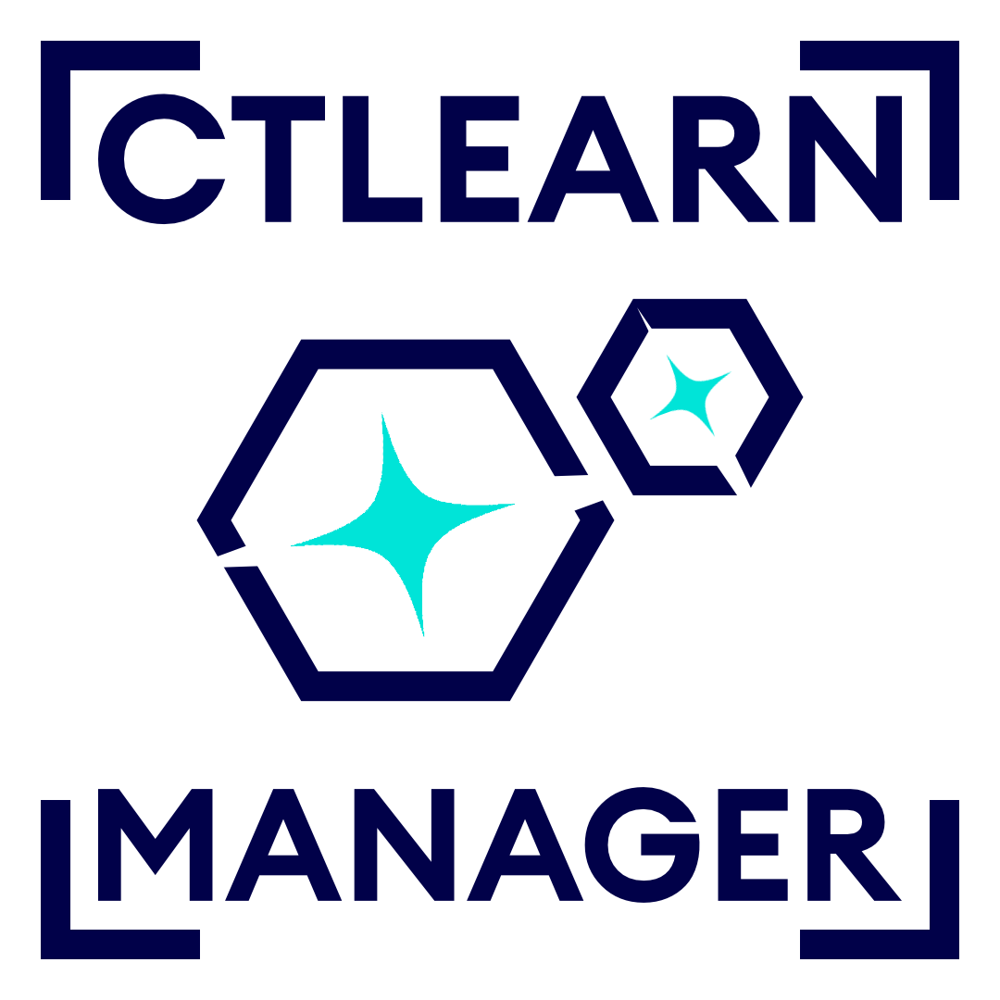

<!--  -->

# CTLearn Manager

A compagnon package to CTLearn that enables to manage models to train, test, monitor and benchmark them.

[Documentation](https://ctlearn-manager.readthedocs.io/en/latest/)
