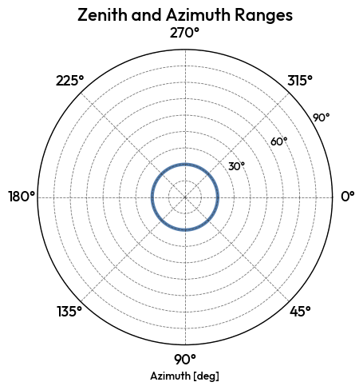

1. Creating CTLearn Model Managers
==================================

The first step is to create your ``ctlearn_model_index`` file. It is a HDF5 file containing a table per model.
It contains one table per model, regardless of the task it is used for. The ``parameters`` table contains the general information about your model, such as its name, directory, reconstruction task, channels, telescopes, and training epochs.
Other tables store the training and testing data, the IRFs, and the DL2 files for MC and real data. That way, CTLearn Manager can easily retrieve all relevant data for the plots and IRF production explained below, without the user needing to remember.

Create a model manager
-----------------------

First, define a model index where the Manager's data will be stored.

.. code-block:: python

    # Where all the models are stored
    MODEL_INDEX_FILE = "/home/user/CTLearn/Software/CTLearn-Manager/ctlearn_models_index.h5"

Then, create a series of ``TrainingSamples`` for your model. Each ``TrainingSample`` contains the path to the training files, the pattern to search for, and the zenith distance of the training data. Put them all in arrays for gamma and proton and pass them to the ``CTLearnModelManager``.

.. note::

    The azimuth is optional, but it is recommended to include it if you have it.

.. code-block:: python

    # Training samples
    gamma_training_samples = [
        TrainingSample(
            directory='/home/user/CTLearn/Data/DL1/SST1M/MC/Gamma_diffuse/20deg/merged/training/',
            pattern=["gamma_diffuse*.h5"],
            zenith_distance= 20 * u.deg,
            azimuth = 180 * u.deg, # Optional
        )]
    proton_training_samples = [
        TrainingSample(
            directory='/home/user/CTLearn/Data/DL1/SST1M/MC/Proton_diffuse/20deg/merged/training/',
            pattern=["proton*.h5"],
            zenith_distance= 20 * u.deg,
            azimuth = 180 * u.deg, # Optional
        )]

Finally, create the ``CTLearnModelManager`` object with the general parameters of your model.

.. code-block:: python

    # General parameters
    model_parameters = {
        'model_nickname' : "type_tel2_20deg",
        'model_dir' : "/home/user/CTLearn/Data/CTLearn_Models_SST1M/", # Where the model is stored
        'notes' : "Tel2 model for 20deg zenith distance",
        'reco' : 'type', #["energy", "direction", "type"]
        'channels' : ['cleaned_image', 'cleaned_relative_peak_time'], # Order matters
        'telescope_names' : ['SST1M_2'],
        'telescope_ids' : [2],
        'max_training_epochs' : 15, 
        'gamma_training_samples' : gamma_training_samples,
        'proton_training_samples' : proton_training_samples, 
    }

    # Create the model manager
    new_model = CTLearnModelManager(model_parameters, MODEL_INDEX_FILE)

Visualisation
-------------

In order to check if your model is correctly set up, you can plot the zenith and azimuth ranges of your training data, as well as the training nodes.

.. code-block:: python

    new_model.plot_zenith_azimuth_ranges()
    new_model.plot_training_nodes()

