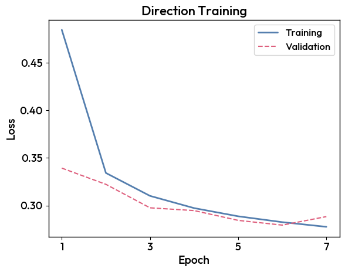

2. Training
===========

.. important::

    CTLearnManager uses a ``ClusterConfiguration`` in order to facilitate the submission of jobs and creation of slurm jobs.
    It automatically detects on what cluster you are (among the supported ones, open an issue to add more), as well as the python environment.
    If you are not on a cluster, slurm will not be used and processing will happen locally.
    If you wish to change default values, or choose not to run on slurm for some small tasks, set ``use_cluster=False``.

    If you want to create a custom configuration, proceed as follow, and pass it to the ``CTLearnModelManager``, ``TriModelManager`` or ``TriModelCollection`` you are using.

    .. code-block:: python

        cluster_config = ClusterConfiguration(python_env='ctlearn', partition='short', time='2:00:00', use_cluster=True, account='aswg')
        Stereo_Tri_Model = CTLearnTriModelManager(..., cluster_configuration=cluster_config)

In order to train a model, make sure that the relevant Monte-Carlo files for training have been set up. In the case of a particle type classification model ``type``, both gamma and proton MC files need to be provided.

The first step is to load your model from the index :

.. code-block:: python

    MODEL_INDEX_FILE = "/home/user/CTLearn/Software/CTLearn-Manager/ctearn_models_index.h5"
    model = load_model_from_index("model_nickname", MODEL_INDEX_FILE)

Then, you can train the model :

.. code-block:: python

    model.launch_training(n_epochs=15)

If the number of epochs is not specified, the training will continue until the maximum number of epochs is reached. The model will be saved at the end of each epoch.

.. important::

    If the training is interrupted, you can resume it by calling the same function. A new version of the model will be created, loading the weights from the last saved epoch.

Finally, you can plot the loss function evolution :

.. code-block:: python

    model.plot_loss()

