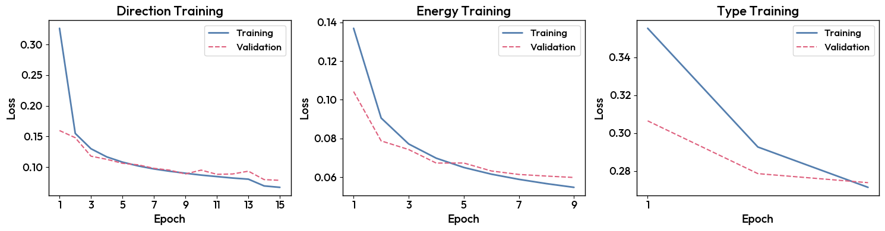

3. Tri-Model Managers
=====================

Once your models are trained for each task, the main component that will be used for analysis and data reconstruction (DL1 to DL2) will be the ``TriModelManager``.
As its name suggests, it is a manager that contains the three models: ``energy``, ``direction``, and ``type``.

The creation of a ``TriModelManager`` is similar to the creation of a ``CTLearnModelManager``.
The main difference is that you need to pass the three models to the ``TriModelManager`` constructor.

.. code-block:: python

    MODEL_INDEX_FILE = "/home/user/CTLearn/Software/CTLearn-Manager/ctearn_models_index.h5"
    energy_model = load_model_from_index("energy_stereo_20deg", MODEL_INDEX_FILE)
    direction_model = load_model_from_index("direction_stereo_20deg", MODEL_INDEX_FILE)
    type_model = load_model_from_index("type_stereo_20deg", MODEL_INDEX_FILE)
    Stereo_Tri_Model = CTLearnTriModelManager(direction_model=direction_model, energy_model=energy_model, type_model=type_model)

One can plot the loss function evolution for the tree models:

.. code-block:: python

    Stereo_Tri_Model.plot_loss()

