5. Monte-Carlo DL2 analysis
===========================

DL2 Visualisation
-----------------

CTLearn Manager offers a variety of tools to visualize the performance of your model. Below, you will find all the plots thatcan be produced from the DL2 Monte-Carlo files used for testing.
They are split in 3 categories: gamma-hadron classification, direction reconstruction, and energy reconstruction.

Gamma-Hadron classification
~~~~~~~~~~~~~~~~~~~~~~~~~~~	
A useful plot for quick checking of the classification performance is the distribution of the classification score for gammas and protons. The ROC curve is also a good way to visualize the performance of the model.

Distribution
^^^^^^^^^^^^

Plot the distribution of the classification score for gammas and protons.

.. code-block:: python

    Stereo_Tri_Model.plot_DL2_classification(20, 0)

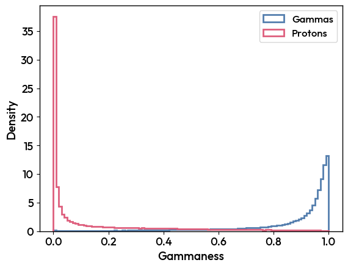

ROC curves
^^^^^^^^^^

Plot the ROC curve for the gamma-hadron classification, in bins of energy.

.. code-block:: python

    Stereo_Tri_Model.plot_ROC_curve_DL2(20,0, nbins=5)

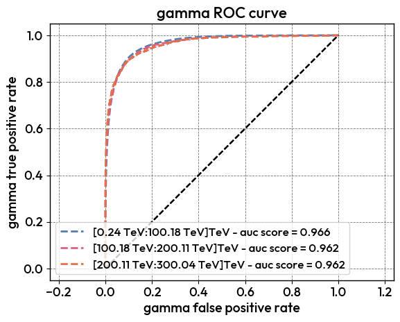

Direction reconstruction
~~~~~~~~~~~~~~~~~~~~~~~~

Plot the angular resolution and sky maps of your DL2 data.

Sky maps
^^^^^^^^
.. code-block:: python

    Stereo_Tri_Model.plot_DL2_AltAz(20, 0)

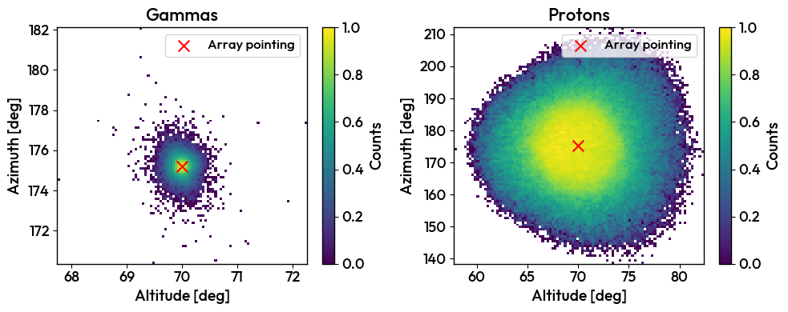

Angular resolution
^^^^^^^^^^^^^^^^^^
.. code-block:: python

    Stereo_Tri_Model.plot_angular_resolution_DL2(20, 0)

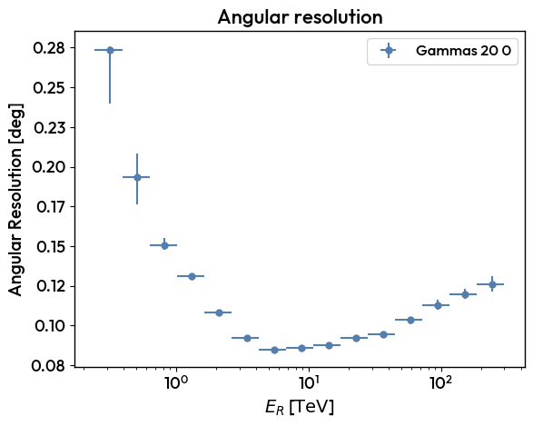

Energy reconstruction
~~~~~~~~~~~~~~~~~~~~~

Plot the energy distribution, migration matrix, and energy resolution of your DL2 data.

Distribution
^^^^^^^^^^^^

.. code-block:: python

    Stereo_Tri_Model.plot_DL2_energy(20, 0)

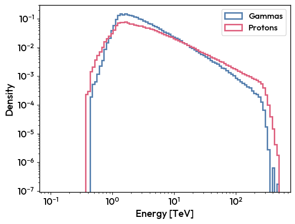

Migration matrix
^^^^^^^^^^^^^^^^

.. code-block:: python

    Stereo_Tri_Model.plot_migration_matrix(20, 0)

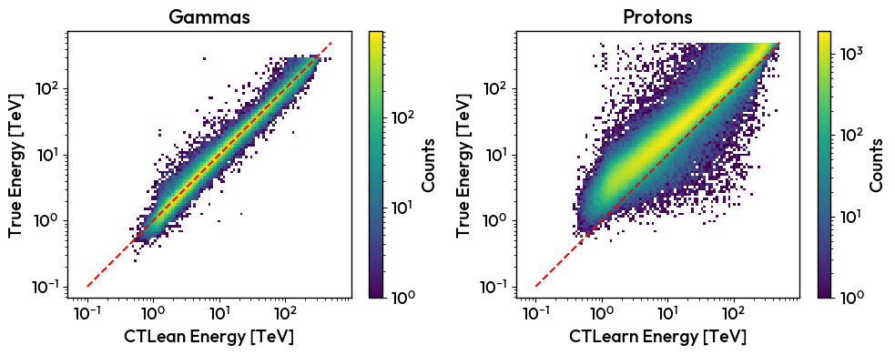

Energy resolution
^^^^^^^^^^^^^^^^^

.. code-block:: python

    Stereo_Tri_Model.plot_energy_resolution_DL2(20, 0)

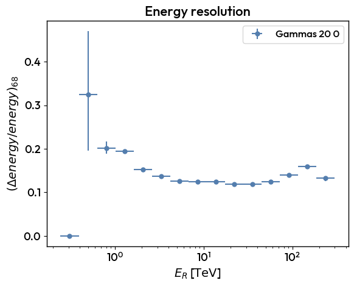

IRFs production
---------------
The first step is to produce the IRFs for your model. The IRFs are produced from the DL2 Monte-Carlo files used for testing. The IRFs are stored in the manager and can be used for the DL2 analysis.

Load the TriModelManager from the index :

.. code-block:: python

    MODEL_INDEX_FILE = "/home/user/CTLearn/Software/CTLearn-Manager/ctearn_models_index.h5"
    energy_model = load_model_from_index("energy_stereo_20deg", MODEL_INDEX_FILE)
    direction_model = load_model_from_index("direction_stereo_20deg", MODEL_INDEX_FILE)
    type_model = load_model_from_index("type_stereo_20deg", MODEL_INDEX_FILE)
    Stereo_Tri_Model = CTLearnTriModelManager(direction_model=direction_model, energy_model=energy_model, type_model=type_model)

CTLearn Manager uses the ctapipe IRF production tools ans requires one file per type of particle. The manager offers the possibility to merge your DL2 files into one file per particle type.
These new files will be saved in the index and used for all MC analysis done with CTLearn Manager.

.. code-block:: python

    Stereo_Tri_Model.merge_DL2_files(20, 0, "output_gamma.dl2.h5", "output_proton.dl2.h5", overwrite=True)

Then, the user can produce the IRFs for the model. The IRFs are stored in the manager and can be used for the DL2 analysis.
It fil create a cuts file, an IRF file and a benchmark file.

.. code-block:: python

    config = "/home/blacave/CTLearn/Software/CTLearn-Manager/src/ctlearn_manager/resources/public-conf.yml"
    output_cuts_file="/home/blacave/CTLearn/Data/CTLearn_Models_SST1M/IRFs/20deg70_stereo_cuts.fits"
    output_irf_file="/home/blacave/CTLearn/Data/CTLearn_Models_SST1M/IRFs/20deg70_stereo_IRFs.fits"
    output_benchmark_file="/home/blacave/CTLearn/Data/CTLearn_Models_SST1M/IRFs/20deg70_stereo_benchmark.fits"

    Stereo_Tri_Model.produce_irfs(20, 0, 
                              config=config, 
                              output_cuts_file=output_cuts_file, 
                              output_irf_file=output_irf_file,
                              output_benchmark_file=output_benchmark_file,
                              )

IRFs visualisation
------------------

Finally, you can visualize the IRFs and the benchmark file.

.. note::

    The plots from bechmark of IRFs are different from the plots from DL2 MC files shown above, due to the optimization of the IRFs.

.. code-block:: python

    Stereo_Tri_Model.plot_benchmark(20, 0)

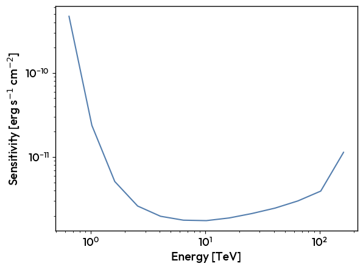
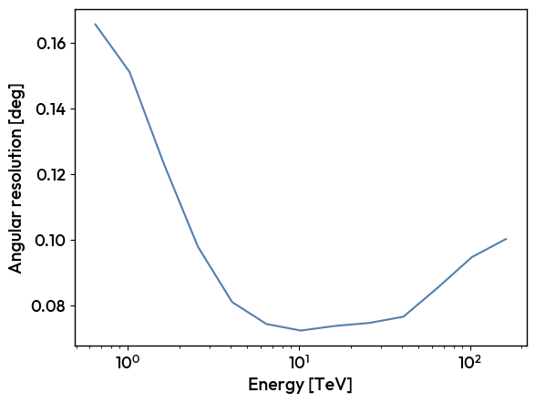
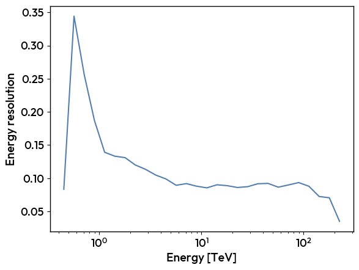
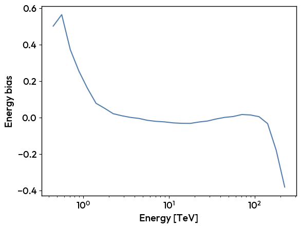

.. code-block:: python

    Stereo_Tri_Model.plot_irfs(20, 0)

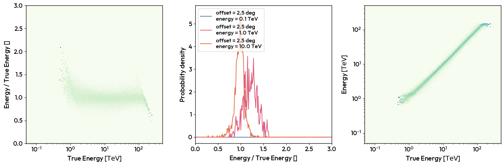

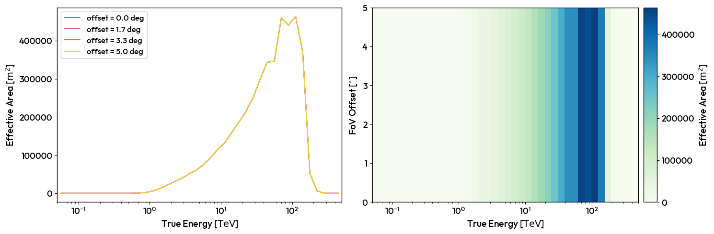

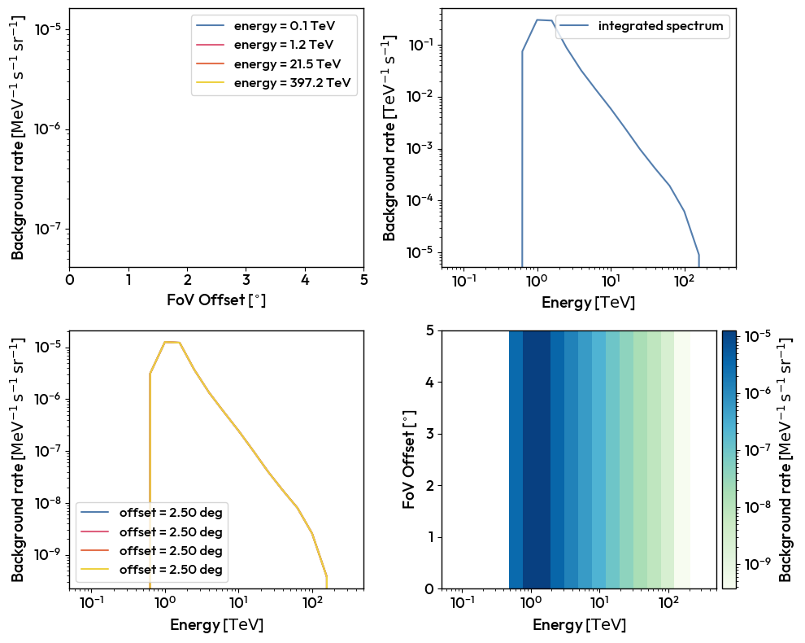
