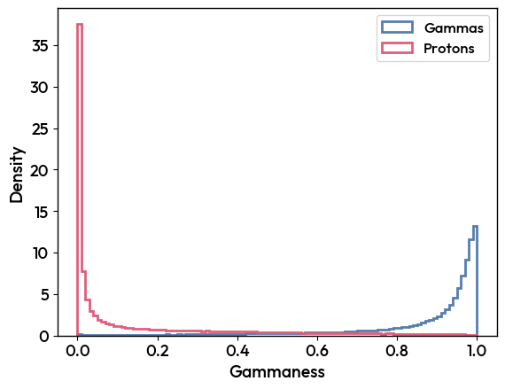
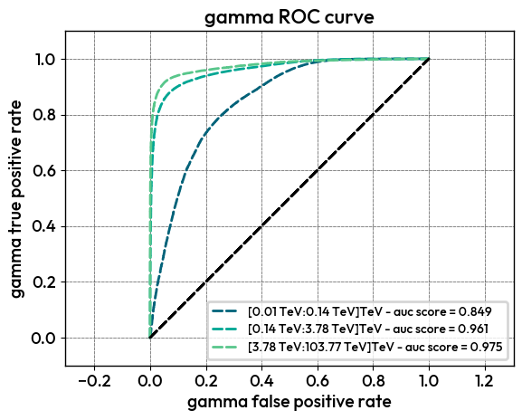
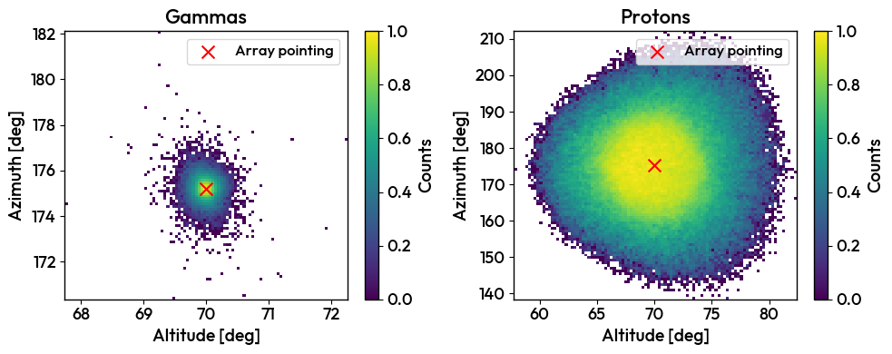
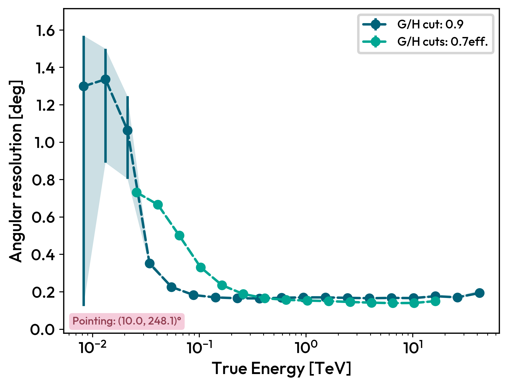
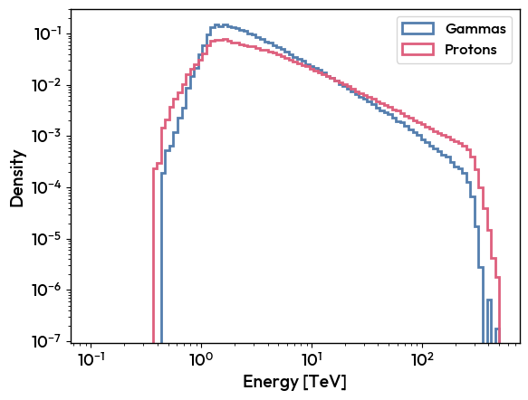
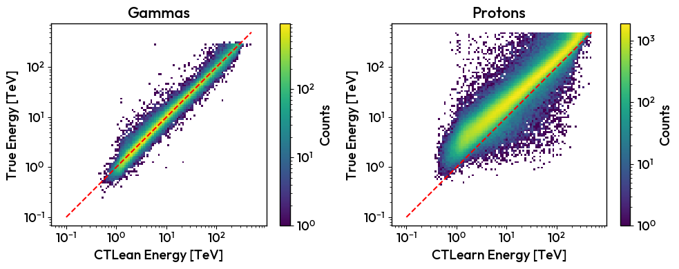
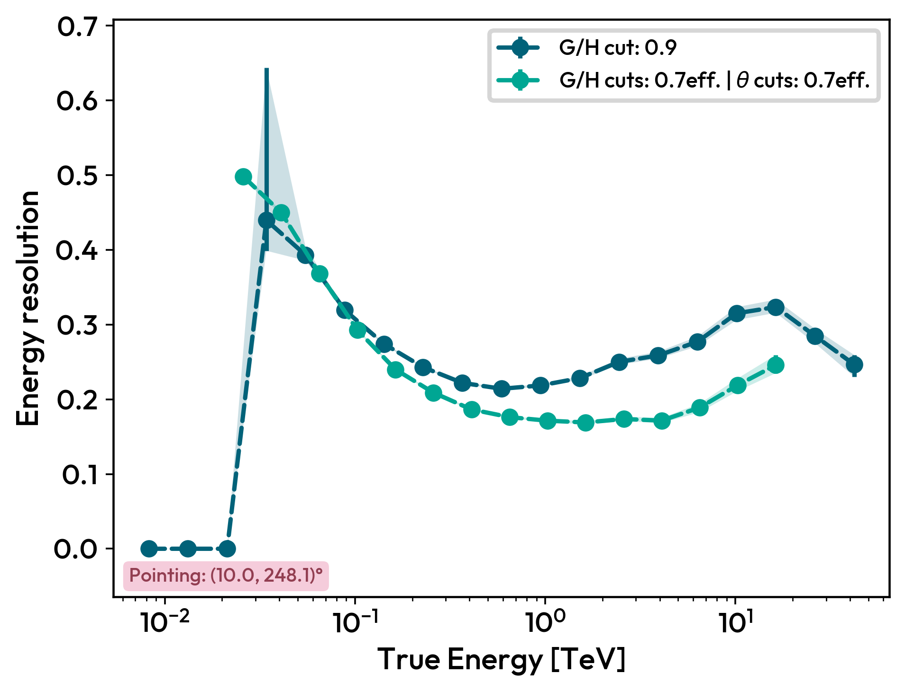

6. Monte-Carlo DL2 analysis
===========================

Applying cuts to the data
-------------------------

The Manager allows you to apply cuts to the data through the `Cuts`class, or the `DefaultCuts` which contains premade sets of cuts, such as global 0.9 gammaness cut or 70% efficiency cut.

Note that in order to use efficiency based of sensitivity imptimized cuts (therefore energy-dependent cuts), you need to have produced correspondin IRFs and cuts files, with a config file that corresponds to the cuts you require.

There are 3 types of cuts :

- Global cuts : these cuts are applied to all the data, and are not energy dependent. ``CutType.GLOBAL``

- Energy dependent efficiency cuts : cuts based on target gamma and theta efficiencies, and are energy dependent. ``CutType.EFFICIENCY_OPTIMIZED``

- Energy dependent sensitivity cuts : these cuts are optimized for sensitivity, and are energy dependent. ``CutType.SENSITIVITY_OPTIMIZED``

With this, you can create any kind of cuts:

.. code-block:: python

    from ctlearn_manager.utils import Cuts, CutType, DefaultCuts

    # Global cuts
    cuts = Cuts(
        cut_type=CutType.GLOBAL,
        gammaness_cut=0.9,
        # theta_cut=0.4,
    )
    cuts = DefaultCuts.GH_0_9.value

    # Efficiency optimized cuts
    cuts = Cuts(
        cut_type=CutType.EFFICIENCY_OPTIMIZED,
        efficiency_gammaness=0.7,
        efficiency_theta=0.7,
    )
    cuts = DefaultCuts.EFF_70.value

    # Sensitivity optimized cuts
    cuts = Cuts(cut_type=CutType.SENSITIVITY_OPTIMIZED)

DL2 Visualisation
-----------------

CTLearn Manager offers a variety of tools to visualize the performance of your model. Below, you will find all the plots thatcan be produced from the DL2 Monte-Carlo files used for testing.
They are split in 3 categories: gamma-hadron classification, direction reconstruction, and energy reconstruction.
It is good practice to define the zenith and azimuth of your Monte-Carlo files before plotting. They are printed when you load the ``TriModelManager``.

.. code-block:: python

    zenith, azimuth = 10 * u.deg, 180 * u.deg

Gamma-Hadron classification
~~~~~~~~~~~~~~~~~~~~~~~~~~~	
A useful plot for quick checking of the classification performance is the distribution of the classification score for gammas and protons. The ROC curve is also a good way to visualize the performance of the model.

Distribution
^^^^^^^^^^^^

Plot the distribution of the classification score for gammas and protons.

.. code-block:: python

    Tri_Model.plot_DL2_classification(zenith, azimuth)

ROC curves
^^^^^^^^^^

Plot the ROC curve for the gamma-hadron classification, in bins of energy.

.. code-block:: python

    Tri_Model.plot_ROC_curve_DL2(zenith, azimuth, nbins=3)

Direction reconstruction
~~~~~~~~~~~~~~~~~~~~~~~~

Plot the angular resolution and sky maps of your DL2 data.

Sky maps
^^^^^^^^
.. code-block:: python

    Tri_Model.plot_DL2_AltAz(zenith, azimuth, particle_types=[ParticleType.GAMMA_POINT, ParticleType.PROTON])

Angular resolution
^^^^^^^^^^^^^^^^^^

The angular resolution can be plot for a list of directions, if you leave the zeniths and azimuths empty, the Manager will plot all available directions by default.
You can have either mutliple zeniths and azimuths, or multiple cuts.
You can also specify the ``ParticleType`` to plot the angular resolution for a specific type of particle.

.. code-block:: python

    Tri_Model.plot_angular_resolution_DL2([zenith], [azimuth], cuts=[DefaultCuts.EFF_70.value]) # One specific zenith and azimuth with 70% efficiency cut, you can have multiple zeniths and azimuths if you only have one cut
    Tri_Model.plot_angular_resolution_DL2([zenith], [azimuth], cuts=[DefaultCuts.EFF_70.value, Cuts(gammaness_cut=0.9)]) # One specific zenith and azimuth with 70% efficiency cut and global 0.9 gammaness cut
    Tri_Model.plot_angular_resolution_DL2(cuts=[Cuts(gammaness_cut=0.9)]) # All available zeniths and azimuths with gloabal 0.9 gammaness cut

Energy reconstruction
~~~~~~~~~~~~~~~~~~~~~

Plot the energy distribution, migration matrix, and energy resolution of your DL2 data.

Distribution
^^^^^^^^^^^^

.. code-block:: python

    Tri_Model.plot_DL2_energy(zenith, azimuth)

Migration matrix
^^^^^^^^^^^^^^^^

Specify the desired ``ParticleType`` in a list to to plot one migration matrix for each type of particle.
.. code-block:: python

    Tri_Model.plot_migration_matrix(zenith, azimuth, particle_types=[ParticleType.GAMMA_POINT, ParticleType.PROTON])

Energy resolution
^^^^^^^^^^^^^^^^^

The energy resolution can be plot for a list of directions, if you leave the zeniths and azimuths empty, the Manager will plot all available directions by default.
You can have either mutliple zeniths and azimuths, or multiple cuts.
You can also specify the ``ParticleType`` to plot the angular resolution for a specific type of particle.

.. code-block:: python

    Tri_Model.plot_energy_resolution_DL2([zenith], [azimuth], cuts=[DefaultCuts.EFF_70.value, Cuts(gammaness_cut=0.9)])

.. IRFs production
.. ---------------
.. The first step is to produce the IRFs for your model. The IRFs are produced from the DL2 Monte-Carlo files used for testing. The IRFs are stored in the manager and can be used for the DL2 analysis.

.. Load the TriModelManager from the index :

.. .. code-block:: python

..     MODEL_INDEX_FILE = "/home/user/CTLearn/Software/CTLearn-Manager/ctearn_models_index.h5"
..     energy_model = load_model_from_index("energy_stereo_20deg", MODEL_INDEX_FILE)
..     direction_model = load_model_from_index("direction_stereo_20deg", MODEL_INDEX_FILE)
..     type_model = load_model_from_index("type_stereo_20deg", MODEL_INDEX_FILE)
..     Tri_Model = CTLearnTriModelManager(direction_model=direction_model, energy_model=energy_model, type_model=type_model)

.. CTLearn Manager uses the ctapipe IRF production tools ans requires one file per type of particle. The manager offers the possibility to merge your DL2 files into one file per particle type.
.. These new files will be saved in the index and used for all MC analysis done with CTLearn Manager.

.. .. code-block:: python

..     Tri_Model.merge_DL2_files(zenith, azimuth, "output_gamma.dl2.h5", "output_proton.dl2.h5", overwrite=True)

.. Then, the user can produce the IRFs for the model. The IRFs are stored in the manager and can be used for the DL2 analysis.
.. It fil create a cuts file, an IRF file and a benchmark file.

.. .. code-block:: python

..     config = "/home/blacave/CTLearn/Software/CTLearn-Manager/src/ctlearn_manager/resources/public-conf.yml"
..     output_cuts_file="/home/blacave/CTLearn/Data/CTLearn_Models_SST1M/IRFs/20deg70_stereo_cuts.fits"
..     output_irf_file="/home/blacave/CTLearn/Data/CTLearn_Models_SST1M/IRFs/20deg70_stereo_IRFs.fits"
..     output_benchmark_file="/home/blacave/CTLearn/Data/CTLearn_Models_SST1M/IRFs/20deg70_stereo_benchmark.fits"

..     Tri_Model.produce_irfs(zenith, azimuth, 
..                               config=config, 
..                               output_cuts_file=output_cuts_file, 
..                               output_irf_file=output_irf_file,
..                               output_benchmark_file=output_benchmark_file,
..                               )

.. IRFs visualisation
.. ------------------

.. Finally, you can visualize the IRFs and the benchmark file.

.. .. note::

..     The plots from bechmark of IRFs are different from the plots from DL2 MC files shown above, due to the optimization of the IRFs.

.. .. code-block:: python

..     Tri_Model.plot_benchmark(zenith, azimuth)

.. .. image:: images/sensitivityBench.png
..     :width: 400
.. .. image:: images/AngularResBench.png
..     :width: 400
.. .. image:: images/EnergyResBench.png
..     :width: 400
.. .. image:: images/EnergyBiasBench.png
..     :width: 400

.. .. code-block:: python

..     Tri_Model.plot_irfs(zenith, azimuth)

.. .. image:: images/energyIRF.png

.. .. image:: images/AeffIRF.png

.. .. image:: images/bkgIRF.png
