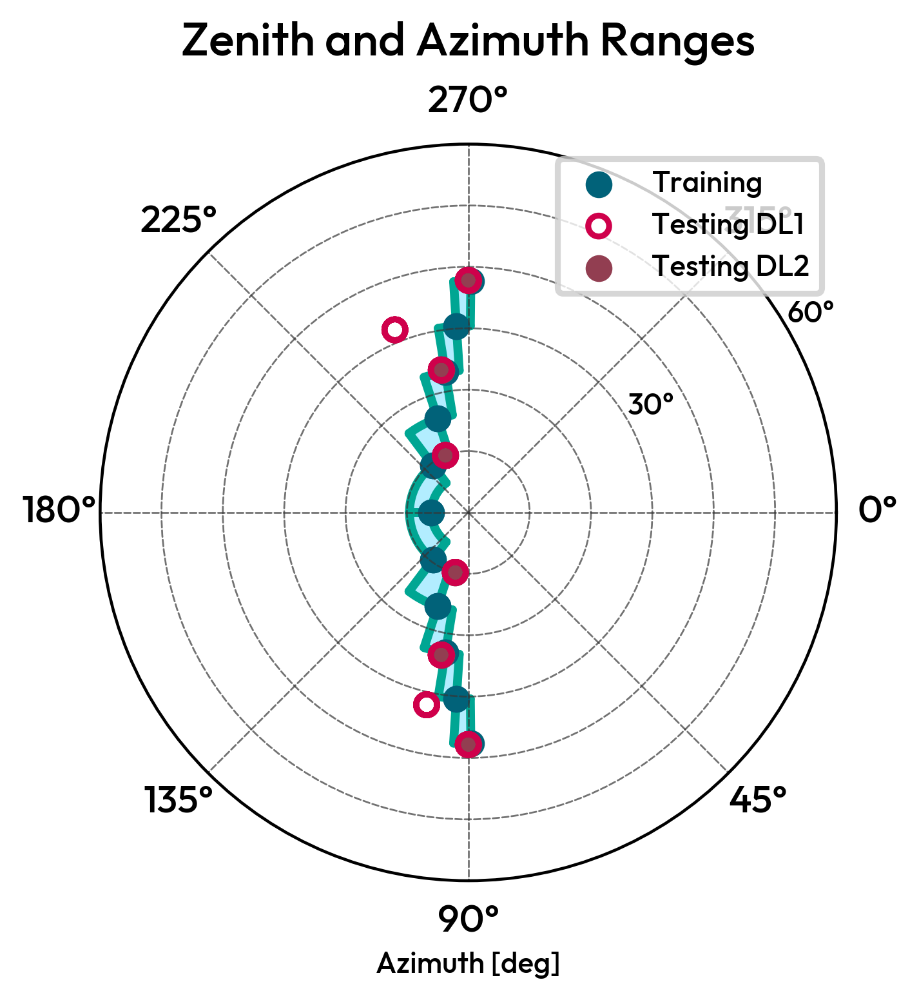

7. DL1 to DL2 on real data
==========================

There are two cases for predicting real data:

1. Predicting data with one signle model

2. Predicting data with a collection of models, each one applying to a restricted region of the sky.

In the first case, you can use the ``CTLearnTriModelManager`` class. In the second case, you can use the ``TriModelCollection`` class.

Standard data
-------------

.. code-block:: python

    Tri_Model.predict_data(input_file, output_file)

lstchain data
-------------

.. code-block:: python

    Tri_Model.predict_lstchain_data(input_file, output_file)

Tri-Model Collection
--------------------

You may have a series of models, each applying to a restricted region of the sky. In this case, you can create a ``TriModelCollection`` object that will manage all the models. 
The Manager will used the relevant model for each file based on its average pointing.

.. code-block:: python

    MODEL_INDEX_FILE = "/path/to/your/ctlearn_models_index.h5"
    tri_models = []
    Cluster_config = ClusterConfiguration(time="00:20:00", partition="normal", account="cta08", use_cluster=True, environment="ctlearn") # Set the amount of time etc.

    for i in range(10):
        energy_model = load_model_from_index(f"energy_model_nickname_{i}", MODEL_INDEX_FILE)
        direction_model = load_model_from_index(f"direction_model_nickname_{i}", MODEL_INDEX_FILE)
        type_model = load_model_from_index(f"type_model_nickname_{i}", MODEL_INDEX_FILE)
        Tri_Model = CTLearnTriModelManager(direction_model=direction_model, energy_model=energy_model, type_model=type_model, cluster_configuration=Cluster_config)
        tri_models.append(Tri_Model)
    
    CRAB_dec_triModels = TriModelCollection(tri_models, cluster_configuration=Cluster_config)
    Cluster_config.info()

You can plot the range of validity for the whole collection of Tri-Models :

.. code-block:: python

    CRAB_dec_triModels.plot_zenith_azimuth_ranges()

Then, you can predict the data for the whole collection :

Use ``predict_lstchain_run`` if you are on the LST cluster and want to predict the data for a run.

.. code-block:: python

    runs = [2972, 2973, 2988, 3095, 3096, 3273, 3274, 3275, 3318, 3319, 3320, 3338]

    for run in runs:
        output_dir = f"/fefs/aswg/workspace/user/ctlearnLSTData/DL2_Multimodels/{run:05d}/"
        os.system(f"mkdir -p {output_dir}")
        CRAB_dec_triModels.predict_lstchain_run(
            run = run,
            output_dir = output_dir,
            overwrite=True,
        )

Use ``predict_lstchain_data`` if you are on the LST cluster and want to predict the data for a file.