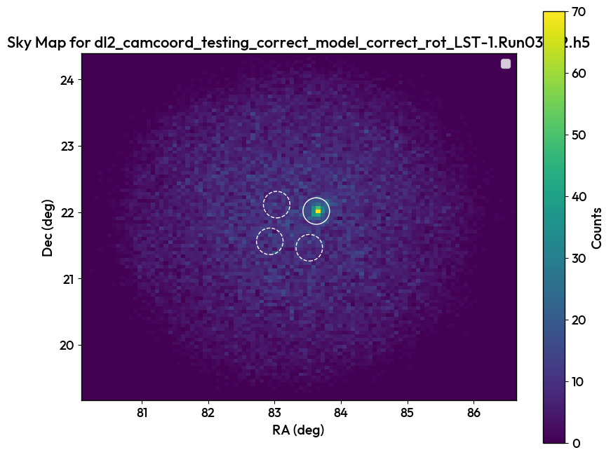

7. Real data DL2 analysis
=========================

Predicting real data is done with a ``TriModelManager``, or a ``TriModelCollection`` of multiple models can be applied to a larger set of data, for example if each model correspond to a different pointing in the sky, the relevant one will predict each file.

.. important::

    CTLearnManager uses a ``ClusterConfiguration`` in order to facilitate the submission of jobs and creation of slurm jobs.
    It automatically detects on what cluster you are (among the supported ones, open an issue to add more), as well as the python environment.
    If you are not on a cluster, slurm will not be used and processing will happen locally.
    If you wish to change default values, or choose not to run on slurm for some small tasks, set ``use_cluster=False``.

    If you want to create a custom configuration, proceed as follow, and pass it to the ``CTLearnModelManager``, ``TriModelManager`` or ``TriModelCollection`` you are using.

    .. code-block:: python

        cluster_config = ClusterConfiguration(python_env='ctlearn', partition='short', time='2:00:00', use_cluster=True, account='aswg')
        Stereo_Tri_Model = CTLearnTriModelManager(..., cluster_configuration=cluster_config)

.. note::

    It is recomanded to use a cluster with slurm to parallelize the processing if you have multiple DL2 files.

As usual, have your Tri-Model ready. 

.. code-block:: python

    MODEL_INDEX_FILE = "/home/user/PhD/Analysis/CTLearnManager/ctlearn_models_index.h5"
    cluster_config = ClusterConfiguration(python_env='ctlearn', partition='short', time='2:00:00', use_cluster=True)
    energy_model = load_model_from_index(f"LST1_energy_CRABdec_4", MODEL_INDEX_FILE)
    direction_model = load_model_from_index(f"LST1_direction_CRABdec_4", MODEL_INDEX_FILE)
    type_model = load_model_from_index(f"LST1_type_CRABdec_4", MODEL_INDEX_FILE)
    Stereo_Tri_Model = CTLearnTriModelManager(direction_model=direction_model, energy_model=energy_model, type_model=type_model, cluster_configuration=cluster_config)

DL2DataProcessor
----------------

The ``DL2DataProcessor`` is a tool for DL2 data analysis, it can produce sensitivity curves, PSF, 
background discrimination capability of your model, theta square plots, sky maps with on and off regions. 
The Processor needs a TriModelManager that corresponds an equivalent model used to predict the data, meaning 
one of the Collection used for the dataset. This is to ensure the telescopes are the same.
The first step is to process the DL2 data, using slurm is recommended, to extract excess for a range of cuts, 
as well as compute the sky coordinates of all events. They are stored and pickled in a directory of choice. 
**This is needed only once per file.**

.. code-block:: python

    DL2Processor = DL2DataProcessor(
        ["Your DL2 files"],
        Stereo_Tri_Model, 
        gammaness_cut=0.9, 
        dl2_processed_dir="Processed_dir")

Once the rocessing is done, reload the DL2DataProcessor, it will now read the data from the processed files and should drastically reduce the time for reading large numbers of files.

.. code-block:: python

    DL2Processor.plot_skymap()
    DL2Processor.plot_theta2_distribution(25)

.. image:: images/DL2Theta2plot.png
    :width: 400

A variety of other plots can be produced.

.. code-block:: python

    DL2Processor.plot_bkg_discrimination_capability()
    DL2Processor.plot_excess_vs_background_rates()
    DL2Processor.plot_excess_and_background_rates_vs_energy()
    DL2Processor.plot_PSF()
    DL2Processor.plot_sensitivity()

RFCounterpart
-------------

Used on the LST cluster, ``LazyRFCounterpart`` will process the same runs as passed by the ``DL2DataProcessor``, they are the same class so the same features can be extracted.

.. warning::

    The LazyRFCounterpart can only be used on the LST cluster. Use RFCounterpart instead if you are not on the LST cluster.

.. code-block:: python

    RFDL2Processor = LazyRFCounterpart(DL2Processor, dl2_processed_dir="Processed_dir", gammaness_cut=0.8)

Combinator2000
--------------

``Combinator2000`` enables to take energy, direction and type from different sources, CTLearn models or RF, and extract the same features.

.. code-block:: python

    Combinator2000 = Combinator2000(direction_processor, energy_processor, type_processor,)

WhoIsBetter
-----------
``WhoIsBetter`` is a class that takes Processors or ``RFCounterparts`` or Combinator2000s and overlay the curves and the same plots.

.. code-block:: python

    WhoIsBetter = WhoIsBetter([DL2Processor, RFDL2Processor, Combinator2000], labels=["DL2", "RF", "Combinator2000"])
