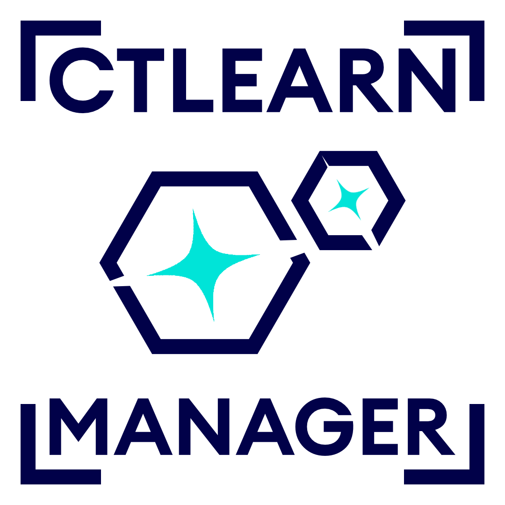

.. CTLearn Manager documentation master file, created by
   sphinx-quickstart on Mon Mar 10 07:26:43 2025.
   You can adapt this file completely to your liking, but it should at least
   contain the root `toctree` directive.

CTLearn Manager documentation
=============================

The CTLearn Manager is a companion python package to the `CTLearn <https://github.com/ctlearn-project/ctlearn>`_ deep learning IACT event reconstruction package. It is designed to guide users from creating a CTLearn model, training, testing, and DL2 analysis to benchmark the model. It also offers a variety of tools to compare models between each other as well as with the standard RF DL2 files. I was developed thanks to the stereo system of SST-1M and the LST-1.
The basic principle of the Manager revolves around a ctlearn_model_index file, that stores all the relevant data for you, such as characteristics of your models, IRFs, range of validity etc. This enables for a user-friendly interface to IACT event reconstruction and benchmarking with CTLearn.
A series of notebooks allows the user to go through the full range of functionalities of the manager.

`GitHub repository <https://github.com/BastienLacave/CTLearn-Manager>`_

.. note::
   It is highly recommended to follow the steps from the beginning in order for the manager to know as much as possible about your models, as it stores data during every step.

.. toctree::
   :maxdepth: 2
   :caption: Contents:

   1createModels
   2training
   3TriModels
   4testing
   5MCDL2
   6PredictData
   7DataDL2
   

API Reference
=============

.. currentmodule:: ctlearn_manager

.. autosummary::
   :toctree: _autosummary
   :template: custom-module-template.rst

   model_manager
   tri_model
   tri_model_collection
   utils.DL2_processing
   utils.RF_counterpart
   utils.utils

